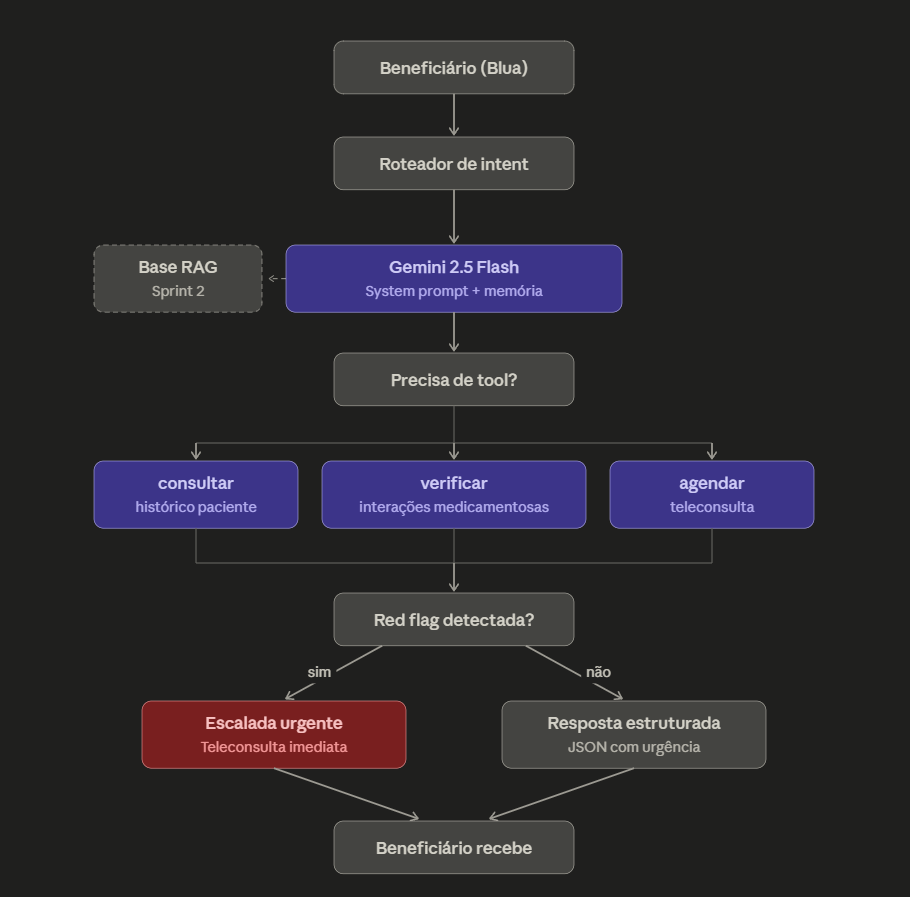

# BluaDiagnostics — Sprint 1

Prova de conceito de um agente conversacional de IA para autoavaliação de saúde dentro do ecossistema Blua da Care Plus.

## Integrantes

| Nome | RM |
|------|-----|
Nicolly Giroto - rm568204
Ana Flávia Couto - rm566603
Guilherme Santana - rm567658
Henry de Oliveira - rm566836
Erik Nikoluk - rm567996
## Persona atendida

**Beneficiário Care Plus em autoavaliação de sintomas.**

Escolhemos essa persona porque o escopo é triagem inicial — não envolve prescrição direta nem decisão clínica vinculante, o que reduz riscos clínicos e éticos enquanto materializa o pilar de "cuidado proativo" descrito na visão estratégica do Blua. O tom é educacional e acolhedor, e a escalada para teleconsulta humana é natural sempre que red flags são detectadas.

## Riscos clínicos e éticos mapeados

| Risco | Mitigação |
|-------|-----------|
| Alucinação em contexto clínico | System prompt explícito proibindo diagnóstico definitivo; respostas estruturadas em JSON com nível de urgência; RAG sobre base validada (Sprint 2) |
| Viés algorítmico | Uso de protocolos padronizados (Manchester simplificado); eval set com casos diversos |
| LGPD — dados sensíveis de saúde (art. 11) | Não armazenar PII em logs; uso de IDs anônimos nas tools; comunicação ao usuário sobre tratamento de dados |
| Responsabilidade sobre diagnóstico | HITL obrigatório: agente sugere, médico decide; aviso permanente "não substitui consulta médica" |
| Falha na detecção de red flag | Lista codificada de sintomas críticos; escalada automática via tool agendar_teleconsulta; eval set com 3 casos red_flag |
| Jailbreak (pedido de prescrição direta) | System prompt com restrições explícitas; eval set com 2 casos de tentativa de jailbreak |

## Stack técnica

- **Linguagem:** Python 3.10+
- **LLM:** Google Gemini 2.5 Flash via `google-generativeai`
- **Function calling:** nativo do Gemini
- **Memória de conversa:** `start\\\_chat()` do SDK Gemini
- **Ambiente de execução:** Google Colab (gestão de secrets via Colab Secrets)
- **Planejado Sprint 2:** ChromaDB para RAG, LangGraph para orquestração multi-agente

## Comparativo de modelos

| Critério | Gemini 2.5 Flash | Claude Haiku 4.5 |
|----------|------------------|-------------------|
| Custo input (US$/1M tokens) | [pesquisar] | [pesquisar] |
| Custo output (US$/1M tokens) | [pesquisar] | [pesquisar] |
| Contexto máximo | [pesquisar] | [pesquisar] |
| Suporte a function calling | Sim, nativo | Sim, nativo |
| Latência média | [pesquisar] | [pesquisar] |
| Privacidade / LGPD | Google Cloud, região configurável | Anthropic, política de não-treino |

**Justificativa da escolha (Gemini 2.5 Flash):** custo competitivo para PoC, integração com ecossistema Google já usado pelo grupo, suporte nativo a function calling e potencial multimodal para receber fotos de exames em sprints futuras.

## Arquitetura proposta

O fluxo completo está descrito no fluxograma acima e detalhado nas seções de system prompt e especificação de tools.

## Estrutura do repositório
bluadiagnostics-sprint1/
├── README.md
├── docs/arquitetura.png
├── evals/sprint1_eval_set.json
├── notebooks/sprint1_poc.ipynb
├── prompts/system_prompt.md
└── tools/tools_spec.json
Como executar o notebook PoC

1. Abra `notebooks/sprint1\\\_poc.ipynb` no Google Colab
2. Configure `GEMINI\\\_API\\\_KEY` nos Colab Secrets (ícone de chave 🔑)
3. Execute as células em ordem (Runtime → Run all)

## Próximos passos (Sprint 2)

- Indexação da base de conhecimento clínico via ChromaDB
- Implementação do RAG completo
- Orquestração multi-agente via LangGraph
- Módulo de prescrição remota com validação médica HITL
Comparativo de modelos

| Critério | Gemini 2.5 Flash | Claude Haiku 4.5 |
|----------|------------------|-------------------|
| Custo input (USD / 1M tokens) | $0.30 | $1.00 |
| Custo output (USD / 1M tokens) | $2.50 | $5.00 |
| Contexto máximo | 1.000.000 tokens | 200.000 tokens |
| Saída máxima | 65.535 tokens | 64.000 tokens |
| Suporte a function calling | Nativo | Nativo (tool use) |
| Multimodalidade | Texto, código, imagem, áudio, vídeo | Texto e imagem |
| Free tier disponível | Sim, via Google AI Studio | Não (apenas via claude.ai web) |
| Privacidade / LGPD | Google Cloud, região configurável; dados de API não usados para treino por padrão | Anthropic, política explícita de não-treino com dados de API |
| Data de lançamento | Jun/2025 | Out/2025 |

**Justificativa da escolha (Gemini 2.5 Flash):** custo cerca de 3x menor que o Claude Haiku 4.5 em input e 2x menor em output — relevante para uma PoC com múltiplos turnos de conversa e chamadas de tools. Possui free tier via Google AI Studio (1.500 RPD), permitindo desenvolvimento sem custo durante a Sprint 1. Contexto de 1M tokens dá margem confortável para injetar base de conhecimento RAG na Sprint 2. Multimodalidade nativa (texto + áudio + imagem) abre caminho para receber fotos de exames e áudios de relato de sintomas em sprints futuras, alinhando com a visão multimodal do Blua.
